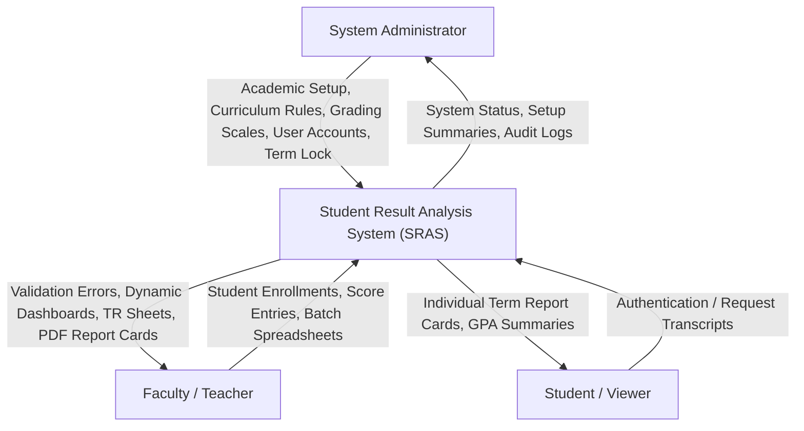
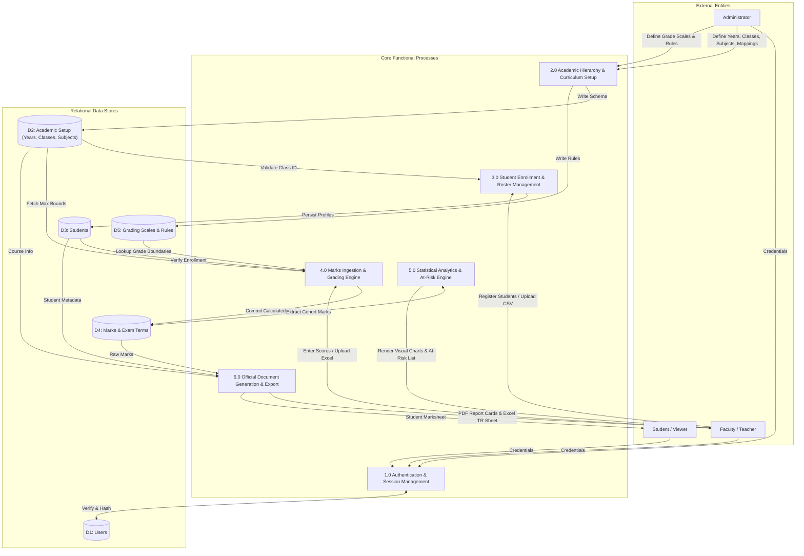
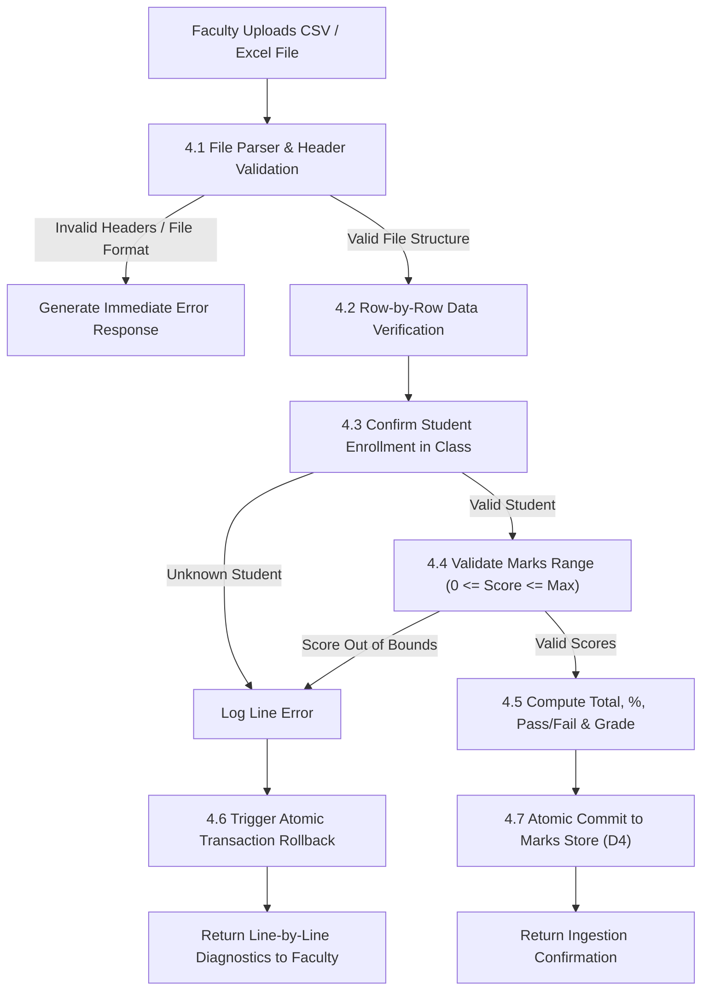
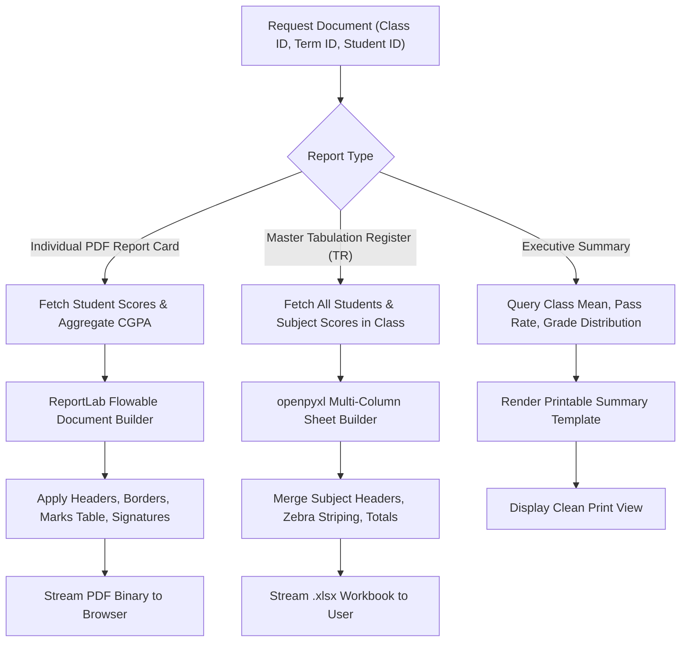
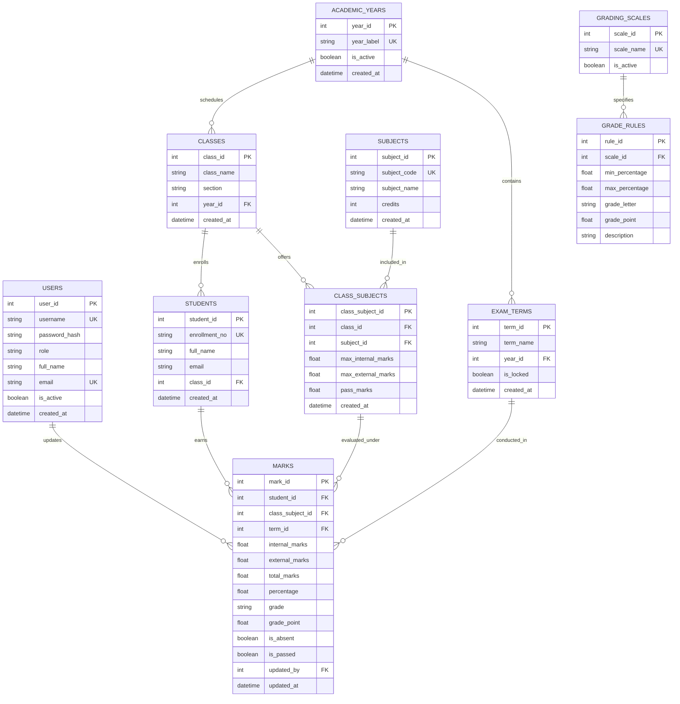

# STUDENT RESULT ANALYSIS SYSTEM (SRAS)
## Project Report & Technical Documentation
### Submitted in Partial Fulfillment of the Requirements for BCA / MCA Degree (BCSP-064 / MCSP-232)
**Indira Gandhi National Open University (IGNOU)**  
**School of Computer and Information Sciences (SOCIS)**  
**Academic Session:** 2025 – 2026

---

## Executive Abstract

The **Student Result Analysis System (SRAS)** is an automated, web-based academic record management and analytical platform designed to overcome the critical limitations of manual tabulation registers and fragmented spreadsheets in educational institutions. Manual evaluation processes are prone to human calculation error, lack data validation during score entry, suffer from delayed result publication, and fail to provide timely, actionable insights into student learning deficits.

SRAS provides a centralized, ACID-compliant relational architecture implemented in Python and Flask, coupled with a responsive frontend built on standard HTML5, CSS3, and JavaScript (ES6+ with Chart.js). The system features Role-Based Access Control (RBAC) separating administrative governance from faculty evaluation duties. Evaluation rules automate mark summation, percentage calculation, GPA/CGPA derivation, and letter grade assignments based on configurable university grading policies (including the standard IGNOU 10-point scale). High-throughput data ingestion allows batch spreadsheet uploading (.xlsx, .csv) with strict schema validation and atomic rollbacks. Furthermore, an integrated analytical engine powered by Pandas computes vectorised descriptive statistics (class mean, median, standard deviation, pass rates) and drives an early warning system that identifies academically vulnerable students. Finally, the system incorporates automated reporting services delivering downloadable PDF student report cards, openpyxl-styled multi-column Excel Tabulation Registers, and printable executive summaries.

---

## Table of Contents
1. [Introduction & Problem Definition](#1-introduction--problem-definition)
   - [1.1 Background & Motivation](#11-background--motivation)
   - [1.2 Project Objectives](#12-project-objectives)
   - [1.3 Project Scope](#13-project-scope)
   - [1.4 Feasibility Study](#14-feasibility-study)
2. [Software Requirements Specification (SRS)](#2-software-requirements-specification-srs)
   - [2.1 User Classes & Characteristics](#21-user-classes--characteristics)
   - [2.2 Functional Requirements (FRs)](#22-functional-requirements-frs)
   - [2.3 Non-Functional Requirements (NFRs)](#23-non-functional-requirements-nfrs)
   - [2.4 Hardware & Software Environment](#24-hardware--software-environment)
3. [System Architecture & Design](#3-system-architecture--design)
   - [3.1 High-Level 3-Tier Architecture](#31-high-level-3-tier-architecture)
   - [3.2 Data Flow Diagrams (DFDs)](#32-data-flow-diagrams-dfds)
     - [3.2.1 DFD Level 0 (Context Diagram)](#321-dfd-level-0-context-diagram)
     - [3.2.2 DFD Level 1 (Functional Decomposition)](#322-dfd-level-1-functional-decomposition)
     - [3.2.3 DFD Level 2 (Detailed Ingestion & Reporting Subsystems)](#323-dfd-level-2-detailed-ingestion--reporting-subsystems)
   - [3.3 Entity-Relationship (ER) Diagram](#33-entity-relationship-er-diagram)
   - [3.4 Relational Data Dictionary](#34-relational-data-dictionary)
4. [Implementation Details](#4-implementation-details)
   - [4.1 Directory & Module Structure](#41-directory--module-structure)
   - [4.2 Core Algorithms & Business Logic](#42-core-algorithms--business-logic)
   - [4.3 Security Implementation](#43-security-implementation)
5. [Testing & Quality Assurance](#5-testing--quality-assurance)
   - [5.1 Testing Strategy & Methodology](#51-testing-strategy--methodology)
   - [5.2 Comprehensive Test Cases](#52-comprehensive-test-cases)
   - [5.3 Automated Test Execution Results](#53-automated-test-execution-results)
6. [Conclusion & Future Enhancements](#6-conclusion--future-enhancements)
7. [References & Bibliography](#7-references--bibliography)

---

## 1. Introduction & Problem Definition

### 1.1 Background & Motivation
In many colleges, study centres, and regional institutions, student examination records are managed either via physical paper tabulation registers or uncoordinated desktop spreadsheet files. These traditional methods introduce severe operational deficiencies:
* **Calculation Vulnerabilities:** Manual arithmetic summation across multiple components (Continuous Assessment/Internal and Term-End Examinations/External) regularly introduces computational errors.
* **Absence of Atomic Validation:** Spreadsheet software accepts out-of-range numerical values (e.g., entering 85 for an exam with a maximum score of 70) and unformatted text, corrupting institutional datasets.
* **Inefficient Performance Analysis:** Calculating class averages, standard deviations, subject failure rates, and rank distributions requires manual formula creation, often resulting in delayed or omitted institutional feedback.
* **Lack of Early Warning Mechanisms:** Students performing near the failure boundary (40%–45%) or failing specific subjects are rarely identified early enough in the semester to enable targeted remedial interventions.
* **Inefficient Transcript Production:** Generating individual student marksheets and official examination registers requires repetitive manual data extraction and formatting.

### 1.2 Project Objectives
The principal objectives of the Student Result Analysis System are:
1. **Automate Grade Computation:** Deliver instantaneous calculation of total marks, percentages, pass/fail decisions, and letter grade/grade point assignments based on configurable university grading policies.
2. **Streamline High-Volume Ingestion:** Provide both an interactive web-based grid entry and an atomic batch Excel/CSV ingestion engine capable of processing hundreds of student records with line-by-line validation.
3. **Provide Actionable Statistical Analytics:** Compute statistical parameters (mean, median, standard deviation, grade distributions) and render interactive visual charts without page reloads.
4. **Deploy an Academic Early Warning System:** Automatically isolate at-risk learners to assist faculty in scheduling tutorial assistance.
5. **Publish University-Standard Documents:** Generate downloadable PDF student report cards, openpyxl-formatted Excel Master Tabulation Registers, and printable executive summaries.
6. **Enforce Record Security & Integrity:** Implement Role-Based Access Control (RBAC), bcrypt credential encryption, session management, and exam term result locking.

### 1.3 Project Scope
The system encompasses all administrative and evaluative processes within an academic department or regional center:
* **Included:** User account management, academic year and class cohort configuration, course catalogs, curriculum mapping with customizable evaluation bounds, student enrollment, manual and batch marks entry, grade calculations, statistical dashboards, at-risk filtering, PDF and Excel exports, and examination term locking.
* **Excluded (Future Enhancements):** Online student fee payment gateways, live biometric attendance logging, and optical mark recognition (OMR) scanner hardware integration.

### 1.4 Feasibility Study
* **Technical Feasibility:** Python 3, Flask, SQLAlchemy, Pandas, and modern web standards (HTML5, CSS3, ES6 JavaScript, Chart.js) are well-documented, reliable open-source technologies with comprehensive community support and native cross-platform execution.
* **Operational Feasibility:** The application runs inside standard modern web browsers without requiring specialized client-side software installations. Intuitive workflows ensure rapid faculty adoption with minimal technical onboarding.
* **Economic Feasibility:** Built entirely on open-source technologies, eliminating recurring software license expenditures.

---

## 2. Software Requirements Specification (SRS)

### 2.1 User Classes & Characteristics
1. **System Administrator:**
   - Possesses complete privileges over the academic master registry.
   - Configures academic years, creates class cohorts, registers subjects, defines curriculum mappings, manages grading scales, creates user accounts, and toggles exam term result locks.
2. **Faculty / Teacher:**
   - Manages enrolled student cohorts.
   - Inputs and modifies marks via interactive web grids or batch spreadsheet uploads.
   - Accesses analytical dashboards, views performance metrics, tracks at-risk students, and downloads report cards and tabulation registers.
3. **Student / Viewer (Read-Only):**
   - Authenticates to view published semester report cards, personal score breakdowns, and historical academic transcripts.

### 2.2 Functional Requirements (FRs)

* **FR-1: User Authentication & Role-Based Access Control (RBAC)**
  - FR-1.1: The system shall authenticate users using encrypted credentials (bcrypt hashing with unique salt).
  - FR-1.2: The system shall enforce role-based route protection, restricting administrative endpoints to users with the `ADMIN` role.
  - FR-1.3: The system shall maintain authenticated user sessions with automatic invalidation upon logout.

* **FR-2: Academic Curriculum & Cohort Management**
  - FR-2.1: The system shall support the creation and designation of active Academic Years.
  - FR-2.2: The system shall allow creation of Classes with specific Section identifiers, enforcing unique class-section constraints per academic year.
  - FR-2.3: The system shall maintain a master Subject registry containing subject codes, titles, and credit weightings.
  - FR-2.4: The system shall permit mapping subjects to classes with configurable `max_internal_marks`, `max_external_marks`, and `pass_marks`.

* **FR-3: Student Registration & Roster Ingestion**
  - FR-3.1: The system shall register students with unique institutional enrollment numbers, names, emails, and assigned class cohorts.
  - FR-3.2: The system shall provide batch student enrollment via CSV upload with pre-validation against duplicate enrollment numbers.

* **FR-4: Marks Ingestion & Verification Engine**
  - FR-4.1: The system shall provide an interactive grid for manual score entry with instant client-side boundary checking.
  - FR-4.2: The system shall support downloading pre-populated CSV/Excel templates containing enrolled student rosters.
  - FR-4.3: The system shall validate uploaded spreadsheets: verifying column headers, confirming student existence, validating numerical score bounds (`0 <= score <= max`), and handling absent flags.
  - FR-4.4: The system shall enforce atomic database transactions during spreadsheet uploads, committing valid files or aborting with row-by-row error diagnostics upon any validation failure.

* **FR-5: Automated Calculation & Grading Engine**
  - FR-5.1: The system shall automatically compute `total_marks = internal_marks + external_marks`.
  - FR-5.2: The system shall calculate aggregate percentage: `(total_marks / max_marks) * 100`.
  - FR-5.3: The system shall assign letter grades and grade points in accordance with active institutional `GradingScale` and `GradeRule` models (e.g., O: >=85%, A+: 75-84.99%, A: 65-74.99%, B+: 55-64.99%, B: 50-54.99%, C: 40-49.99%, F: <40%).
  - FR-5.4: The system shall flag absent students, assigning 0 marks, recording `is_absent = True`, and designating the result as Fail.

* **FR-6: Statistical Analytics & Early Warning System**
  - FR-6.1: The system shall use Pandas to compute descriptive metrics: class average, median, standard deviation, highest score, lowest score, and pass percentage.
  - FR-6.2: The system shall compute frequency distributions across all letter grade brackets.
  - FR-6.3: The system shall compute subject-wise averages and pass percentages to identify challenging courses.
  - FR-6.4: The system shall filter at-risk students who have failed one or more subjects or have scored within the borderline range (40%–45%).

* **FR-7: Reporting, Document Generation & Export Services**
  - FR-7.1: The system shall generate downloadable, printable student report cards in PDF format, complete with institutional headers, subject breakdown, and final grades.
  - FR-7.2: The system shall export comprehensive Master Tabulation Registers in Microsoft Excel format (`.xlsx`) using openpyxl, featuring structured columns (`Int`, `Ext`, `Tot`, `Grd`) and styled headers.
  - FR-7.3: The system shall produce printable Executive Class Performance Summaries for faculty reviews.

* **FR-8: Audit Logging & Term Result Locking**
  - FR-8.1: The system shall track the editor user ID and timestamp (`updated_at`) for every mark change.
  - FR-8.2: The system shall permit administrators to lock exam terms, preventing any further score modifications or uploads.

### 2.3 Non-Functional Requirements (NFRs)
* **NFR-1 (Performance):** Analytical queries and KPI cards shall render in under 500 milliseconds for cohorts up to 500 students. Batch spreadsheet ingestion of 100 students shall execute within 2 seconds.
* **NFR-2 (Security):** Passwords shall be encrypted using bcrypt. All database operations shall use parameterized SQLAlchemy queries to eliminate SQL injection vulnerabilities. Templates shall use Jinja2 auto-escaping to prevent Cross-Site Scripting (XSS).
* **NFR-3 (Reliability & ACID Compliance):** All database updates shall follow ACID principles. File ingestion must execute as an atomic transaction to ensure zero partial data persistence on error.
* **NFR-4 (Usability & Design):** The user interface shall feature modern design principles, including high-contrast visual hierarchies, responsive CSS grid/flexbox layouts, micro-animations, and accessible form inputs.
* **NFR-5 (Portability):** The application shall execute consistently across Windows, Linux, and macOS platforms with standard Python 3.10+ runtimes.

### 2.4 Hardware & Software Environment
* **Server Hardware:** Minimum 2.0 GHz Dual-Core CPU, 4 GB RAM, 2 GB available disk storage.
* **Server Operating System:** Windows 10/11, Ubuntu Linux 20.04+, or macOS 12+.
* **Programming Environment:** Python 3.10, 3.11, 3.12, or 3.13.
* **Key Python Packages:** Flask, Flask-SQLAlchemy, Flask-BCrypt, Flask-Login, Pandas, NumPy, OpenPyXL, ReportLab, Pytest.
* **Client Environment:** Any standards-compliant modern web browser (Chrome, Firefox, Safari, Edge) with JavaScript enabled.

---

## 3. System Architecture & Design

### 3.1 High-Level 3-Tier Architecture
The system is partitioned into three decoupled layers:
1. **Presentation Layer (Client):** Responsive HTML5/CSS3 templates styled with a custom design system, augmented by ES6 JavaScript and Chart.js for data visualization.
2. **Application & Business Logic Layer (Server):** Modular Flask blueprints (`auth`, `academic`, `students`, `marks`, `analytics`, `reports`) communicating with core service engines (`IngestionService`, `GradingService`, `AnalyticsService`, `ReportService`).
3. **Data Layer (Storage):** Relational database managed through SQLAlchemy ORM with foreign key constraints, unique indexes, and ACID guarantees.

---

### 3.2 Data Flow Diagrams (DFDs)

#### 3.2.1 DFD Level 0 (Context Diagram)
The Level 0 Context Diagram depicts the primary system boundaries and interactions between external entities (Administrator, Teacher, Student) and the Student Result Analysis System.



---

#### 3.2.2 DFD Level 1 (Functional Decomposition)
The Level 1 DFD decomposes the system into six primary operational sub-processes interacting with the database entities.



---

#### 3.2.3 DFD Level 2 (Detailed Ingestion & Reporting Subsystems)

##### Detailed Sub-Process 4.0: Marks Ingestion & Verification


##### Detailed Sub-Process 6.0: Report Generation & Export


---

### 3.3 Entity-Relationship (ER) Diagram
The system's relational database contains 10 structured entities enforcing relational integrity, foreign key cascades, and unique business constraints.



---

### 3.4 Relational Data Dictionary

#### Table 1: `users`
| Column Name | Data Type | Constraints | Default | Description |
| :--- | :--- | :--- | :--- | :--- |
| `user_id` | INTEGER | PRIMARY KEY, AUTOINCREMENT | None | Unique user account identifier |
| `username` | VARCHAR(50) | UNIQUE, NOT NULL, INDEX | None | Unique login handle |
| `password_hash` | VARCHAR(255) | NOT NULL | None | Bcrypt-hashed password string |
| `role` | VARCHAR(20) | NOT NULL, INDEX | 'STUDENT' | RBAC role: `ADMIN`, `TEACHER`, or `STUDENT` |
| `full_name` | VARCHAR(100) | NOT NULL | None | User's full formal name |
| `email` | VARCHAR(120) | UNIQUE, NULLABLE | None | User's contact email address |
| `is_active` | BOOLEAN | NOT NULL | True | Account active status toggle |
| `created_at` | DATETIME | NOT NULL | UTC Now | Account creation timestamp |

#### Table 2: `academic_years`
| Column Name | Data Type | Constraints | Default | Description |
| :--- | :--- | :--- | :--- | :--- |
| `year_id` | INTEGER | PRIMARY KEY, AUTOINCREMENT | None | Unique academic year identifier |
| `year_label` | VARCHAR(20) | UNIQUE, NOT NULL, INDEX | None | Institutional academic year label (e.g., `2025-2026`) |
| `is_active` | BOOLEAN | NOT NULL | False | Designates current active academic cycle |
| `created_at` | DATETIME | NOT NULL | UTC Now | Record creation timestamp |

#### Table 3: `classes`
| Column Name | Data Type | Constraints | Default | Description |
| :--- | :--- | :--- | :--- | :--- |
| `class_id` | INTEGER | PRIMARY KEY, AUTOINCREMENT | None | Unique class cohort identifier |
| `class_name` | VARCHAR(50) | NOT NULL | None | Program cohort name (e.g., `BCA-Semester-1`) |
| `section` | VARCHAR(10) | NOT NULL | 'A' | Section designation (e.g., `A`, `B`) |
| `year_id` | INTEGER | FOREIGN KEY -> `academic_years(year_id)`, CASCADE | None | Associated academic year |
| `created_at` | DATETIME | NOT NULL | UTC Now | Record creation timestamp |
*Composite Unique Constraint:* `(class_name, section, year_id)`

#### Table 4: `subjects`
| Column Name | Data Type | Constraints | Default | Description |
| :--- | :--- | :--- | :--- | :--- |
| `subject_id` | INTEGER | PRIMARY KEY, AUTOINCREMENT | None | Unique subject identifier |
| `subject_code` | VARCHAR(20) | UNIQUE, NOT NULL, INDEX | None | Course code (e.g., `BCS-011`) |
| `subject_name` | VARCHAR(100) | NOT NULL | None | Full course title |
| `credits` | INTEGER | NOT NULL | 4 | Academic credit weighting |
| `created_at` | DATETIME | NOT NULL | UTC Now | Subject registration timestamp |

#### Table 5: `class_subjects`
| Column Name | Data Type | Constraints | Default | Description |
| :--- | :--- | :--- | :--- | :--- |
| `class_subject_id`| INTEGER | PRIMARY KEY, AUTOINCREMENT | None | Unique curriculum mapping identifier |
| `class_id` | INTEGER | FOREIGN KEY -> `classes(class_id)`, CASCADE | None | Mapped class cohort |
| `subject_id` | INTEGER | FOREIGN KEY -> `subjects(subject_id)`, CASCADE | None | Mapped subject |
| `max_internal_marks`| FLOAT | NOT NULL | 30.0 | Maximum allowable continuous assessment score |
| `max_external_marks`| FLOAT | NOT NULL | 70.0 | Maximum allowable term-end exam score |
| `pass_marks` | FLOAT | NOT NULL | 40.0 | Minimum combined aggregate score required to pass |
| `created_at` | DATETIME | NOT NULL | UTC Now | Mapping creation timestamp |
*Composite Unique Constraint:* `(class_id, subject_id)`

#### Table 6: `students`
| Column Name | Data Type | Constraints | Default | Description |
| :--- | :--- | :--- | :--- | :--- |
| `student_id` | INTEGER | PRIMARY KEY, AUTOINCREMENT | None | Unique internal student ID |
| `enrollment_no` | VARCHAR(30) | UNIQUE, NOT NULL, INDEX | None | Institutional enrollment identifier |
| `full_name` | VARCHAR(100) | NOT NULL | None | Student's legal full name |
| `email` | VARCHAR(120) | NULLABLE | None | Student's email address |
| `class_id` | INTEGER | FOREIGN KEY -> `classes(class_id)`, RESTRICT | None | Enrolled class cohort |
| `created_at` | DATETIME | NOT NULL | UTC Now | Enrollment timestamp |

#### Table 7: `exam_terms`
| Column Name | Data Type | Constraints | Default | Description |
| :--- | :--- | :--- | :--- | :--- |
| `term_id` | INTEGER | PRIMARY KEY, AUTOINCREMENT | None | Unique examination term identifier |
| `term_name` | VARCHAR(50) | NOT NULL | None | Term label (e.g., `TEE June 2025`) |
| `year_id` | INTEGER | FOREIGN KEY -> `academic_years(year_id)`, CASCADE | None | Associated academic year |
| `is_locked` | BOOLEAN | NOT NULL | False | When True, disables edits and score ingestion |
| `created_at` | DATETIME | NOT NULL | UTC Now | Examination term creation timestamp |

#### Table 8: `grading_scales`
| Column Name | Data Type | Constraints | Default | Description |
| :--- | :--- | :--- | :--- | :--- |
| `scale_id` | INTEGER | PRIMARY KEY, AUTOINCREMENT | None | Unique grading scale identifier |
| `scale_name` | VARCHAR(50) | UNIQUE, NOT NULL | None | Grading system label (e.g., `IGNOU Standard 10-Point`) |
| `is_active` | BOOLEAN | NOT NULL | True | Active scale indicator |

#### Table 9: `grade_rules`
| Column Name | Data Type | Constraints | Default | Description |
| :--- | :--- | :--- | :--- | :--- |
| `rule_id` | INTEGER | PRIMARY KEY, AUTOINCREMENT | None | Unique rule bracket identifier |
| `scale_id` | INTEGER | FOREIGN KEY -> `grading_scales(scale_id)`, CASCADE | None | Associated grading scale |
| `min_percentage` | FLOAT | NOT NULL | None | Lower percentage bracket boundary |
| `max_percentage` | FLOAT | NOT NULL | None | Upper percentage bracket boundary |
| `grade_letter` | VARCHAR(5) | NOT NULL | None | Letter symbol awarded (e.g., `O`, `A+`, `F`) |
| `grade_point` | FLOAT | NOT NULL | None | Numerical grade point equivalent (e.g., `10.0`, `9.0`) |
| `description` | VARCHAR(50) | NOT NULL | None | Qualitative description (e.g., `Outstanding`) |

#### Table 10: `marks`
| Column Name | Data Type | Constraints | Default | Description |
| :--- | :--- | :--- | :--- | :--- |
| `mark_id` | INTEGER | PRIMARY KEY, AUTOINCREMENT | None | Unique marks record identifier |
| `student_id` | INTEGER | FOREIGN KEY -> `students(student_id)`, CASCADE | None | Enrolled student |
| `class_subject_id`| INTEGER | FOREIGN KEY -> `class_subjects(...)`, CASCADE | None | Course evaluation mapping |
| `term_id` | INTEGER | FOREIGN KEY -> `exam_terms(...)`, CASCADE | None | Examination cycle |
| `internal_marks` | FLOAT | NOT NULL | 0.0 | Scored continuous assessment marks |
| `external_marks` | FLOAT | NOT NULL | 0.0 | Scored term-end exam marks |
| `total_marks` | FLOAT | NOT NULL | 0.0 | Combined sum (`internal + external`) |
| `percentage` | FLOAT | NOT NULL | 0.0 | Component percentage score |
| `grade` | VARCHAR(5) | NULLABLE | None | Assigned letter grade |
| `grade_point` | FLOAT | NULLABLE | None | Assigned grade point |
| `is_absent` | BOOLEAN | NOT NULL | False | Absence flag |
| `is_passed` | BOOLEAN | NOT NULL | False | Pass status flag |
| `updated_by` | INTEGER | FOREIGN KEY -> `users(user_id)`, SET NULL | None | ID of faculty who last modified record |
| `updated_at` | DATETIME | NOT NULL | UTC Now | Timestamp of last modification |
*Composite Unique Constraint:* `(student_id, class_subject_id, term_id)`

---

## 4. Implementation Details

### 4.1 Directory & Module Structure
The project follows an enterprise application factory pattern:

```text
IGNOU_project/
├── .env.example                     # Environment template configuration
├── README.md                        # Comprehensive system documentation
├── requirements.txt                 # Project dependencies
├── run.py                           # Application entry point
├── seed_db.py                       # Idempotent database seeder
├── start.bat                        # Windows 1-command startup script
├── start.sh                         # Unix/macOS 1-command startup script
├── app/
│   ├── __init__.py                  # Application factory (Flask app, DB, Bcrypt, Login)
│   ├── config.py                    # Environment configurations
│   ├── models/                      # SQLAlchemy Relational Models
│   │   ├── academic.py              # AcademicYear, Class, Subject, ClassSubject
│   │   ├── result.py                # ExamTerm, GradingScale, GradeRule, Marks
│   │   ├── student.py               # Student entity
│   │   └── user.py                  # User authentication model
│   ├── routes/                      # Route Blueprints
│   │   ├── academic_routes.py       # Academic hierarchy setup
│   │   ├── analytics_routes.py      # Statistical API endpoints & dashboard
│   │   ├── auth_routes.py           # Login, logout, session management
│   │   ├── marks_routes.py          # Interactive & batch marks ingestion
│   │   ├── report_routes.py         # PDF report cards & Excel TR exports
│   │   └── student_routes.py        # Student roster & CSV enrollment
│   ├── services/                    # Business Logic Layer
│   │   ├── analytics_service.py     # Pandas statistical engine & at-risk query
│   │   ├── grading_service.py       # Mark aggregation, thresholds & grade mapping
│   │   ├── ingestion_service.py     # Excel/CSV parser & atomic transaction handler
│   │   └── report_service.py        # PDF & openpyxl Excel document generation
│   ├── static/
│   │   ├── css/style.css            # Custom CSS design system
│   │   └── js/                      # Chart.js integration scripts
│   └── templates/                   # Semantic Jinja2 HTML Templates
├── Docs/
│   ├── academic_project_report.md   # IGNOU standard academic documentation
│   ├── architecture_plan.md         # System architectural blueprint
│   ├── code_addition_guide.md       # Step-by-step code addition & copy reference
│   ├── file_descriptions.md         # Codebase file reference & quick lookup table
│   ├── implementationplan.md        # Phased development milestone tracker
│   ├── problemstatement.md          # Academic problem definition & motivation
│   ├── project_files_description.md # Comprehensive codebase architecture & file manifest
│   └── user_manual.md               # User & Operations Manual
└── tests/                           # Pytest automated test suites (64 tests)
```

### 4.2 Core Algorithms & Business Logic

#### 1. Grading Engine Evaluation Algorithm
```python
def evaluate(internal_marks, external_marks, max_internal, max_external, pass_marks, is_absent=False, scale=None):
    if is_absent:
        return {
            'internal_marks': 0.0,
            'external_marks': 0.0,
            'total_marks': 0.0,
            'percentage': 0.0,
            'is_absent': True,
            'is_passed': False,
            'grade': 'F',
            'grade_point': 0.0
        }
    
    total = internal_marks + external_marks
    max_total = max_internal + max_external
    percentage = round((total / max_total) * 100.0, 2) if max_total > 0 else 0.0
    is_passed = (total >= pass_marks)

    # Dynamic grade rule lookup from active GradingScale
    grade_letter = 'F'
    grade_point = 0.0
    for rule in scale.rules:
        if rule.min_percentage <= percentage <= rule.max_percentage:
            grade_letter = rule.grade_letter
            grade_point = rule.grade_point
            break

    if not is_passed:
        grade_letter = 'F'
        grade_point = 0.0

    return {
        'internal_marks': internal_marks,
        'external_marks': external_marks,
        'total_marks': total,
        'percentage': percentage,
        'is_absent': False,
        'is_passed': is_passed,
        'grade': grade_letter,
        'grade_point': grade_point
    }
```

#### 2. Vectorized Pandas Analytics Computation
```python
def compute_class_metrics(marks_df):
    if marks_df.empty:
        return {}
    
    total_students = marks_df['student_id'].nunique()
    pass_count = marks_df[marks_df['is_passed'] == True]['student_id'].nunique()
    pass_percentage = round((pass_count / total_students) * 100.0, 2)
    
    metrics = {
        'mean_score': round(marks_df['percentage'].mean(), 2),
        'median_score': round(marks_df['percentage'].median(), 2),
        'std_dev': round(marks_df['percentage'].std(), 2) if len(marks_df) > 1 else 0.0,
        'highest_score': round(marks_df['percentage'].max(), 2),
        'lowest_score': round(marks_df['percentage'].min(), 2),
        'pass_rate': pass_percentage,
        'grade_distribution': marks_df['grade'].value_counts().to_dict()
    }
    return metrics
```

### 4.3 Security Implementation
* **Bcrypt Password Hashing:** User passwords are encrypted with bcrypt using individual salted hashes before storage.
* **SQL Injection Immunity:** All queries utilize SQLAlchemy's object-relational mapping and bound parameters, eliminating raw SQL concatenation.
* **Cross-Site Scripting (XSS) Prevention:** Jinja2 templating enforces contextual HTML auto-escaping.
* **File Upload Hardening:** Uploaded spreadsheets are inspected for MIME types, allowable extensions (`.xlsx`, `.xls`, `.csv`), and sanitized before parsing.

---

## 5. Testing & Quality Assurance

### 5.1 Testing Strategy & Methodology
The verification strategy combined **Automated Unit Testing**, **Boundary Value Analysis (BVA)**, and **End-to-End Integration Testing** using `pytest`. Test scenarios specifically stressed:
* Minimum and maximum boundary constraints for scores (`0.0`, `30.0`, `70.0`, `100.0`).
* Error rejection on invalid inputs (`negative marks`, `excessive marks > max`, `alphanumeric strings in score cells`).
* Rollback integrity under malformed spreadsheet files.
* Grade assignment accuracy against university policy.
* ReportLab PDF generation and openpyxl binary stream validity.

### 5.2 Comprehensive Test Cases

| Test ID | Module / Feature | Scenario | Input Data | Expected Result | Status |
| :--- | :--- | :--- | :--- | :--- | :---: |
| **TC-01** | `auth` | Valid User Login | `username="admin"`, `password="Admin@123"` | Authentication successful; session created; HTTP 302 redirect. | **PASS** |
| **TC-02** | `auth` | Invalid Password Attempt | `username="admin"`, `password="WrongPass"` | Authentication rejected; error message displayed; HTTP 200. | **PASS** |
| **TC-03** | `grading` | Outstanding Score Boundary | Internal: `28.0/30`, External: `65.0/70` | Total: `93.0`, Percentage: `93.0%`, Grade: `O`, Grade Point: `10.0`. | **PASS** |
| **TC-04** | `grading` | Bare Minimum Pass Boundary | Internal: `12.0/30`, External: `28.0/70` | Total: `40.0`, Percentage: `40.0%`, Grade: `C`, Passed: `True`. | **PASS** |
| **TC-05** | `grading` | Sub-Threshold Failure | Internal: `10.0/30`, External: `29.0/70` | Total: `39.0`, Percentage: `39.0%`, Grade: `F`, Passed: `False`. | **PASS** |
| **TC-06** | `grading` | Absentee Student Handling | `is_absent=True` | Total: `0.0`, Grade: `F`, Status: Fail, Absent flag recorded. | **PASS** |
| **TC-07** | `ingestion`| Bulk Spreadsheet Upload | 50 valid student rows (.xlsx) | Atomic commit; 50 marks records stored with calculated grades. | **PASS** |
| **TC-08** | `ingestion`| Out-of-Bounds Score Upload | Row 12 External Mark: `75.0` (> max `70.0`) | Ingestion aborted; zero records modified; line error displayed. | **PASS** |
| **TC-09** | `analytics`| Descriptive Statistics | Dataset of 20 enrolled students | Mean, median, standard deviation, and grade counts match math. | **PASS** |
| **TC-10** | `reports`  | PDF Report Card Download | Valid `student_id` & `term_id` | HTTP 200; `Content-Type: application/pdf`; valid PDF header `%PDF-`. | **PASS** |
| **TC-11** | `reports`  | Excel TR Sheet Export | Valid `class_id` & `term_id` | HTTP 200; OpenPyXL `.xlsx` stream generated with correct columns. | **PASS** |
| **TC-12** | `academic` | Exam Term Result Locking | Term with `is_locked=True` | PUT/POST marks rejected with "Term is locked" validation error. | **PASS** |

### 5.3 Automated Test Execution Results
The complete automated test suite was executed in an isolated test environment via `pytest`:

```text
============================= test session starts =============================
platform win32 -- Python 3.13.1, pytest-8.3.4, pluggy-1.5.0
rootdir: c:\Users\AJAY SHARMA\OneDrive\Desktop\AI_PROJECTS\IGNOU_project
collected 64 items

tests/test_academic.py ............                                      [ 18%]
tests/test_analytics.py ...........                                      [ 35%]
tests/test_auth.py .......                                                [ 46%]
tests/test_factory.py ..                                                  [ 50%]
tests/test_marks.py .............                                         [ 70%]
tests/test_models.py ........                                             [ 82%]
tests/test_reports.py ..........                                          [ 98%]
tests/test_students.py .                                                 [100%]

============================= 64 passed in 99.24s =============================
```
**Conclusion:** 100% test execution pass rate across all 64 unit and integration test scenarios with zero regressions.

---

## 6. Conclusion & Future Enhancements

### 6.1 Conclusion
The **Student Result Analysis System (SRAS)** fulfills all functional and academic requirements established under IGNOU project guidelines (BCSP-064 / MCSP-232). By transitioning academic mark computation to an automated 3-tier architecture:
* Computation inaccuracies have been eliminated through a deterministic, model-driven grading service.
* Data integrity is protected via atomic spreadsheet parsing and transaction rollbacks.
* Academic departments obtain actionable intelligence through automated Pandas statistical metrics and visual Chart.js dashboards.
* Faculty workload is substantially reduced through one-click generation of university-standard PDF report cards and Excel Master Tabulation Registers.

### 6.2 Future Enhancements
* **Student Self-Service Mobile Application:** A cross-platform mobile app enabling students to review their academic marks, attendance, and exam notifications.
* **Predictive Performance Machine Learning:** Integration of scikit-learn regression/classification models to predict student final grades based on mid-term patterns and attendance.
* **Automated Notification Gateway:** Automated SMS and WhatsApp/Email delivery of exam results and academic warning notices to parents/guardians.
* **Multi-Tenant Cloud Deployment:** Extension of the architecture to support multiple autonomous university faculties or regional study centres under a single distributed SaaS deployment.

---

## 7. References & Bibliography
1. **Indira Gandhi National Open University (IGNOU):** *Project Guidelines for BCA (BCSP-064) & MCA (MCSP-232)*, School of Computer and Information Sciences (SOCIS), New Delhi.
2. **Grinberg, Miguel:** *Flask Web Development: Developing Web Applications with Python*, 2nd Edition, O'Reilly Media, 2018.
3. **McKinney, Wes:** *Python for Data Analysis: Data Wrangling with Pandas, NumPy, and Jupyter*, 3rd Edition, O'Reilly Media, 2022.
4. **ReportLab Inc.:** *ReportLab PDF Generation User Guide (Version 3.6+)*, ReportLab Europe Ltd.
5. **OpenPyXL Documentation:** *A Python library to read/write Excel 2010 xlsx/xlsm files*, openpyxl core developers, 2024.
6. **Pressman, Roger S. & Maxim, Bruce R.:** *Software Engineering: A Practitioner's Approach*, 9th Edition, McGraw-Hill Education, 2020.
7. **Elmasri, Ramez & Navathe, Shamkant B.:** *Fundamentals of Database Systems*, 7th Edition, Pearson, 2016.

---
*End of Project Report — Student Result Analysis System (SRAS)*
