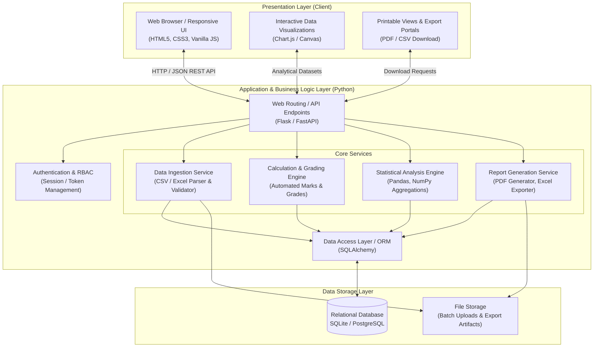
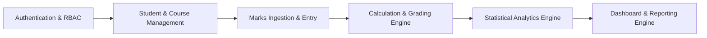
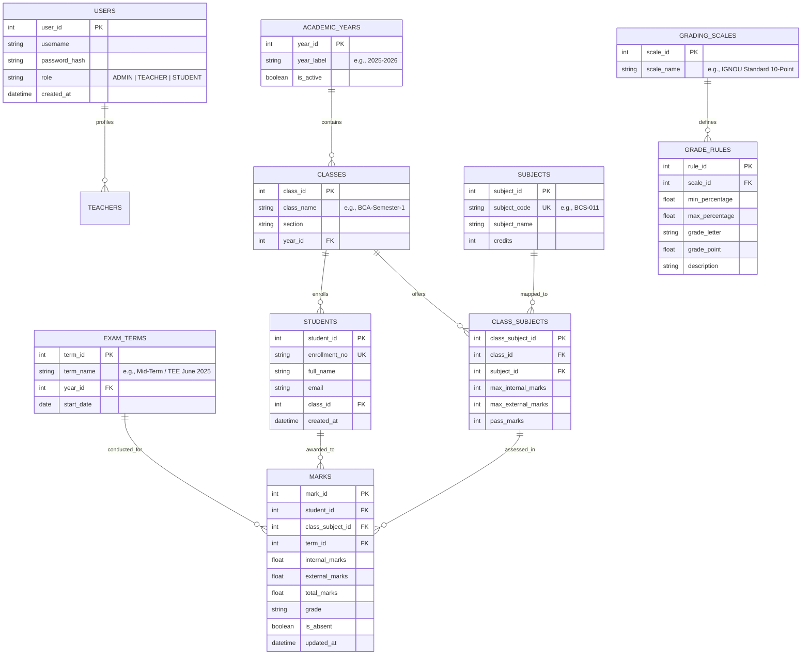
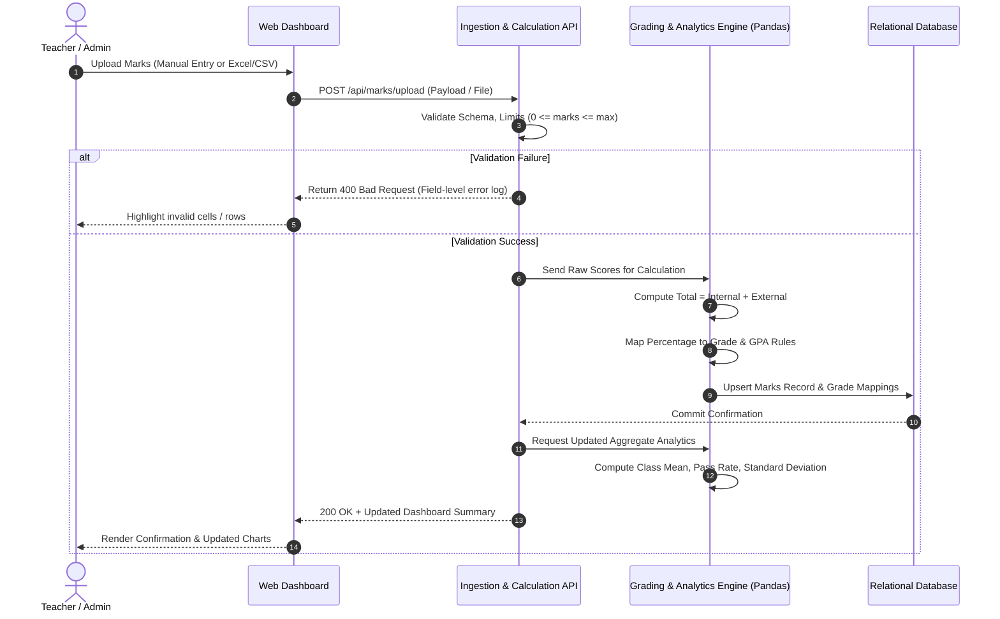
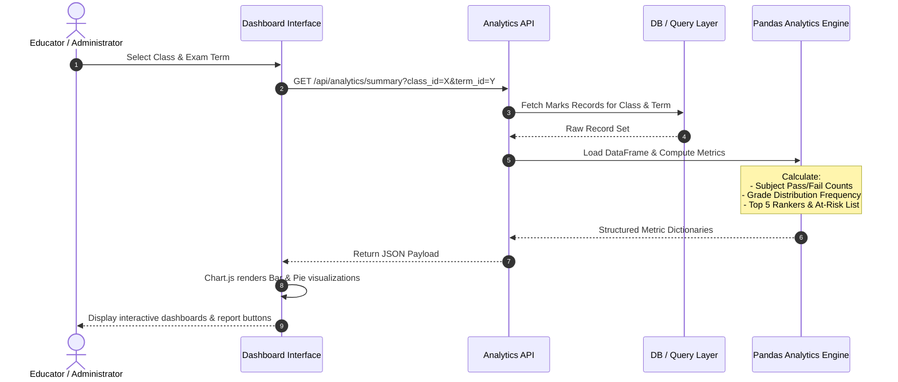
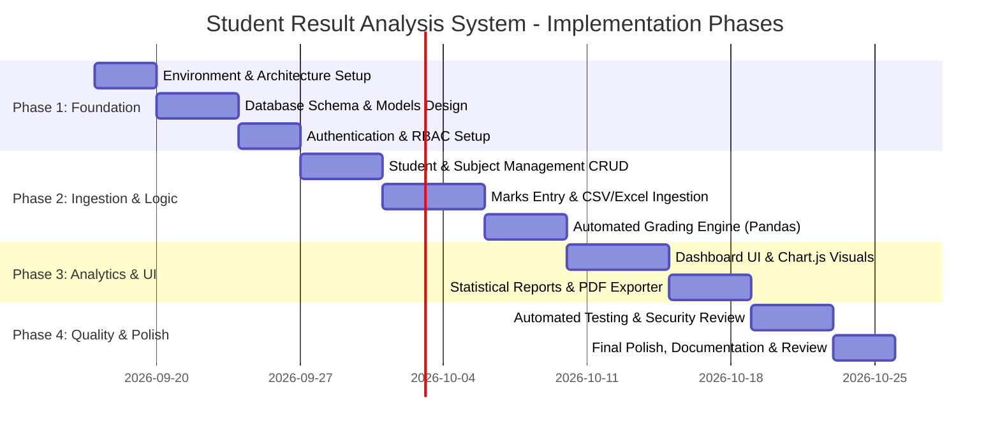

# System Architecture Plan: Student Result Analysis System

## 1. Executive Summary & System Overview

The **Student Result Analysis System** is an automated, centralized academic management and analytical platform. Designed to eliminate the limitations of manual registers and fragmented spreadsheets, the system provides automated result computation, statistical analytics, bulk data ingestion, role-based access, and comprehensive visual reporting.

### 1.1 Objectives
* **Eliminate Calculation Errors:** Automate mark aggregations, percentages, GPA/CGPA, and grade assignments based on configurable grading schemas.
* **Deep Academic Analytics:** Deliver actionable insights, including subject-wise performance, grade distribution, batch comparisons, historical progress tracking, and identifying at-risk students.
* **Streamlined Data Ingestion:** Support both interactive web-based single entry and high-throughput CSV/Excel batch uploads.
* **Secure & Persistent Record-Keeping:** Provide an ACID-compliant relational data store with role-based access control (Admin, Teacher/Evaluator, Student/Viewer).

---

## 2. High-Level System Architecture

The system follows an industry-standard **3-Tier Architecture** (Presentation, Application/Business Logic, and Data Layer), enforcing separation of concerns, maintainability, and scalability.



---

## 3. Technology Stack & Rationale

| Component | Technology | Rationale |
| :--- | :--- | :--- |
| **Frontend Structure & Styling** | **HTML5 & Modern CSS3** | Semantic layout, modern responsive styling (custom design system, CSS Grid/Flexbox, sleek dashboards) with zero framework bloat. |
| **Client-Side Interactivity** | **JavaScript (ES6+) & Chart.js** | Client-side form validations, asynchronous data fetching via Fetch API, and dynamic chart rendering (bar, pie, radar, line charts). |
| **Backend Framework** | **Python (Flask / FastAPI)** | Lightweight, highly readable, modular routing, and native interoperability with Python's data science ecosystem. |
| **Data Analytics & Calculations** | **Pandas & NumPy** | High-performance vectorised operations for aggregations (averages, medians, standard deviations, percentiles, ranking) on tabular datasets. |
| **Database & ORM** | **SQLite (Dev) / PostgreSQL (Prod) via SQLAlchemy** | ACID compliance, schema integrity, foreign key constraints, and smooth abstraction across environments. |
| **Document/Export Engine** | **ReportLab / WeasyPrint & OpenPyXL** | Automated generation of standardized student grade sheets (PDF) and bulk tabular exports (Excel/CSV). |

---

## 4. Core Functional Modules



### 4.1 Authentication & Role-Based Access Control (RBAC)
* **Administrator:** Complete control over academic years, class/subject assignments, user accounts, and system configurations.
* **Teacher / Evaluator:** Input and update marks for assigned classes/subjects, trigger result analysis, upload bulk marks, and generate report cards.
* **Student / Viewer (Optional/Read-Only):** Authenticated access to individual mark sheets, semester progress graphs, and performance history.

### 4.2 Academic Setup & Student Management
* Maintenance of Academic Years/Sessions, Semesters, Classes/Batches, and Subjects.
* Unique student identification (Enrollment/Roll Number), personal details, and course registration mappings.

### 4.3 Marks Ingestion & Entry Module
* **Manual Input Interface:** Form interface with real-time validation (preventing marks outside min/max bounds, handling absent flags).
* **Batch Ingestion:** Upload CSV/Excel templates with automated data validation, syntax checks, duplicate detection, and error rollback.

### 4.4 Automated Calculation & Grading Engine
* Automatic summation of internal/practical assessments and external/term-end exams.
* Standardized percentage and GPA/CGPA computation.
* Dynamic grade assignment based on institutional grading rules (e.g., 10-point scale, IGNOU grading scale: O, A+, A, B+, B, C, P, F).

### 4.5 Statistical Analytics Engine
* **Descriptive Statistics:** Mean, median, standard deviation, highest and lowest scores per subject and class.
* **Distribution Metrics:** Grade breakdown, pass/fail percentage, distribution histograms.
* **Comparative Insights:** Performance comparison across subjects (identifying challenging subjects) and cross-batch evaluations.
* **Early Warning System:** Automated flagging of students failing or near failure thresholds for timely academic intervention.

### 4.6 Reporting & Export Services
* **Student Report Cards:** Formatted single-page PDF transcripts with institutional header, subject breakdown, and final grades.
* **Tabulation Register (TR Sheet):** Comprehensive multi-column master result sheets in Excel/CSV format for official institutional records.
* **Executive Summary Reports:** Printable graphical summaries of overall class performance for heads of department and faculty meetings.

---

## 5. Database Schema & Data Modeling

The relational model ensures data integrity, avoids redundant student data, and supports multiple examination terms and academic years.



---

## 6. End-to-End Data Flow

### 6.1 Marks Processing & Result Generation Flow



### 6.2 Analytical Dashboard Retrieval Flow



---

## 7. Security, Integrity & Validation Strategy

1. **Data Validation Pipeline:**
   * **Client-Side:** Instant boundary feedback (HTML5 input attributes, JavaScript min/max listeners).
   * **Server-Side:** Strict verification against subject boundary thresholds (`0 <= marks <= max_marks`) and data type safety.
   * **Atomic Database Transactions:** Bulk uploads execute within atomic database transactions; any corruption in a record triggers a rollback with specific line-item diagnostic feedback.

2. **Access Control & Permissions:**
   * Password hashing using cryptographic algorithms (`bcrypt` / `argon2`).
   * Session-based authentication with secure HTTP-only cookies or JWT tokens.
   * Granular permission checking before read/write operations on exam results.

3. **Audit Trails & Change Logging:**
   * Every modification to marks records records the editor's user ID and timestamp (`updated_at`), maintaining historical accountability for grade changes.

---

## 8. Directory & Project Structure

The project structure cleanly separates business logic, data models, web routes, and static presentation assets:

```text
IGNOU_project/
│
├── Docs/
│   ├── problemstatement.md            # Problem statement and requirements
│   └── architecture_plan.md           # System Architecture & Design Specification
│
├── app/
│   ├── __init__.py                    # App factory and initialization
│   ├── config.py                      # Configuration settings (Dev, Test, Prod)
│   │
│   ├── models/                        # SQLAlchemy Data Models
│   │   ├── __init__.py
│   │   ├── user.py                    # User & authentication models
│   │   ├── academic.py                # Academic Year, Class, Subject models
│   │   ├── student.py                 # Student profiles
│   │   └── result.py                  # Marks, Exam Terms, Grading rules
│   │
│   ├── routes/                        # Web & API Route Handlers
│   │   ├── __init__.py
│   │   ├── auth_routes.py             # Login, logout, user management
│   │   ├── student_routes.py          # Student registration & listings
│   │   ├── marks_routes.py            # Marks entry & bulk CSV upload
│   │   ├── analytics_routes.py        # Analytics data endpoints
│   │   └── report_routes.py           # PDF and Excel export endpoints
│   │
│   ├── services/                      # Pure Business Logic & Processing
│   │   ├── __init__.py
│   │   ├── grading_service.py         # Grade determination & GPA calculations
│   │   ├── analytics_service.py       # Pandas-based statistical computation
│   │   ├── ingestion_service.py       # CSV/Excel parsing and validation
│   │   └── report_service.py          # PDF generation & tabular file exporter
│   │
│   ├── static/                        # Frontend Static Assets
│   │   ├── css/
│   │   │   ├── main.css               # Core styling tokens & variables
│   │   │   ├── components.css         # Buttons, tables, cards, form inputs
│   │   │   └── dashboard.css          # Analytics grids & chart layouts
│   │   ├── js/
│   │   │   ├── main.js                # Core UI interactions & notifications
│   │   │   ├── marks_entry.js         # Interactive marks table validations
│   │   │   └── charts.js              # Chart.js dashboards & visualizers
│   │   └── assets/                    # Logos, icons, and graphic assets
│   │
│   └── templates/                     # HTML5 Templates
│       ├── base.html                  # Base layout with header & sidebar
│       ├── auth/
│       │   └── login.html
│       ├── dashboard/
│       │   └── index.html             # Overview metrics & KPIs
│       ├── marks/
│       │   ├── entry.html             # Manual tabular entry
│       │   └── upload.html            # Batch file upload
│       ├── analytics/
│       │   └── view.html              # Graphical analytics & charts
│       └── reports/
│           ├── report_card.html       # Printable student marksheet template
│           └── class_summary.html     # Comprehensive class tabulation
│
├── tests/                             # Unit & Integration Tests
│   ├── test_grading.py                # Grading calculations tests
│   ├── test_analytics.py              # Statistical aggregation tests
│   └── test_ingestion.py              # File upload & validation tests
│
├── instance/                          # Local SQLite database instances
├── uploads/                           # Temporary storage for bulk files
├── requirements.txt                   # Project dependencies (Flask, Pandas, SQLAlchemy, etc.)
└── run.py                             # Application entry point
```

---

## 9. Implementation Roadmap & Phases



1. **Phase 1: Foundation & Data Architecture**
   * Set up Python environment and install dependencies (`Flask`, `SQLAlchemy`, `pandas`, `openpyxl`, `reportlab`).
   * Implement relational database models and schema migrations.
   * Configure basic authentication and role-based route protections.

2. **Phase 2: Core Processing & Ingestion Engine**
   * Build interfaces for Academic Year, Class, and Subject configuration.
   * Implement single-record and batch CSV/Excel marks ingestion with validation rules.
   * Develop the automated grading and calculation service.

3. **Phase 3: Statistical Analytics & Visual Dashboards**
   * Implement Pandas-powered aggregations (mean, standard deviation, pass percentages, grade distribution).
   * Develop responsive front-end dashboard with interactive Chart.js visualizations.
   * Build export services for PDF student report cards and Excel master sheets.

4. **Phase 4: Quality Assurance, Security & Deployment**
   * Write comprehensive unit tests for calculation accuracy and boundary conditions.
   * Ensure responsive design on mobile and desktop viewports.
   * Package documentation, setup guides, and sample datasets for academic evaluation.
