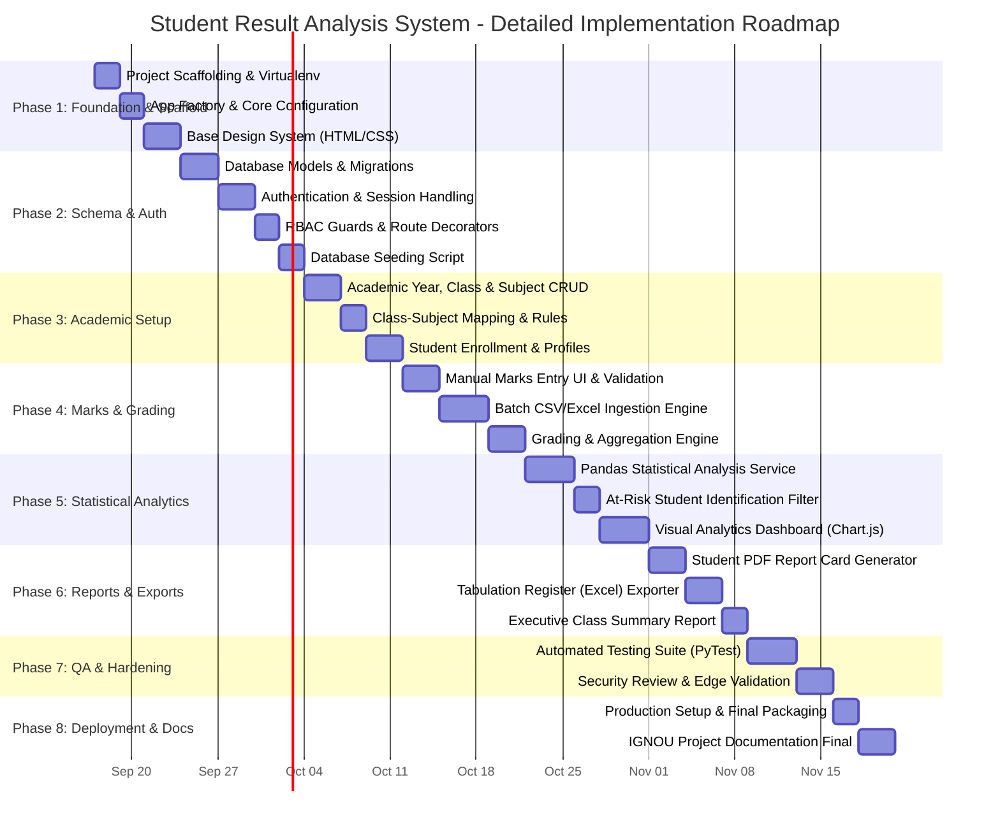

# Detailed Phase-Wise Implementation Plan: Student Result Analysis System

Based on the [Architecture Plan](file:///c:/Users/AJAY%20SHARMA/OneDrive/Desktop/AI_PROJECTS/IGNOU_project/Docs/architecture_plan.md) and the [Problem Statement](file:///c:/Users/AJAY%20SHARMA/OneDrive/Desktop/AI_PROJECTS/IGNOU_project/Docs/problemstatement.md).

---

## 1. Plan Overview & Execution Strategy

### 1.1 Objective
To provide a structured, milestone-driven engineering roadmap for building the **Student Result Analysis System**. The implementation progresses logically from foundation and data modeling to business logic, analytical engines, user interfaces, and reporting pipelines.

### 1.2 Engineering Principles
* **Iterative & Modular Delivery:** Each phase delivers a standalone, testable layer of the system.
* **Separation of Concerns:** Strict decoupling between presentation (HTML/CSS/JS), API routing, service layer (Pandas computation), and database models (SQLAlchemy).
* **Test-Driven Verification:** Acceptance criteria and automated unit tests defined for each phase before proceeding to the next.
* **Fail-Safe Ingestion:** Atomic operations for mark uploads to prevent partial or corrupted record states.

---

## 2. Phase-Wise Master Roadmap

---

## 3. Phase Details & Actionable Milestones

### Phase 1: Foundation, Environment Setup & Design System
> **Goal:** Establish a clean, maintainable project repository, install verified dependencies, and build the baseline visual styling framework.

* [x] **Milestone 1.1: Project Setup & Dependency Configuration**
  * Initialize virtual environment (`venv`).
  * Create `requirements.txt` with locked versions:
    * `Flask` (Web framework)
    * `SQLAlchemy` & `Flask-SQLAlchemy` (ORM)
    * `Flask-Bcrypt` (Password security)
    * `pandas` & `numpy` (Statistical analytics)
    * `openpyxl` & `xlrd` (Excel processing)
    * `reportlab` / `weasyprint` (PDF report card generation)
    * `pytest` (Testing)
  * Set up `.gitignore` for Python, virtual environments, SQLite databases, and temporary file uploads.

* [x] **Milestone 1.2: Flask Application Factory Pattern**
  * Implement `app/__init__.py` using the Application Factory pattern (`create_app(config_name)`).
  * Build `app/config.py` with separate configurations for `Development`, `Testing`, and `Production`.
  * Create top-level runner `run.py`.

* [x] **Milestone 1.3: Core Layout & Modern CSS Design System**
  * Create base styling tokens in `app/static/css/main.css` (color palette, modern sans-serif typography, spacing scales, dark/light contrast).
  * Build reusable UI component styles in `app/static/css/components.css` (data tables, responsive form controls, modal alerts, badge pills for pass/fail/grades).
  * Create master template `app/templates/base.html` with collapsible sidebar, top navigation bar, flash notification banners, and responsive layout grid.

**Deliverables & Acceptance Criteria:**
* Running `python run.py` serves a responsive welcome page with sidebar and header.
* Zero external CSS framework bloat (custom Vanilla CSS).
* Clean separation of static assets and templates.

---

### Phase 2: Data Modeling, Database Migrations & Authentication (RBAC)
> **Goal:** Design and execute the relational schema and implement secure authentication with Role-Based Access Control.

* [x] **Milestone 2.1: Relational Schema Implementation**
  * Implement SQLAlchemy models in `app/models/`:
    * `user.py`: `User` (ID, username, password_hash, role: Admin/Teacher/Student).
    * `academic.py`: `AcademicYear`, `Class`, `Subject`, and `ClassSubject` (maps subject to class with `max_internal`, `max_external`, `pass_marks`).
    * `student.py`: `Student` (ID, enrollment_no, name, email, class_id).
    * `result.py`: `ExamTerm`, `Marks` (internal, external, total, grade, absent flag), `GradingScale`, `GradeRule`.
  * Establish foreign key constraints, indexes on `enrollment_no` and `subject_code`, and cascade rules.

* [x] **Milestone 2.2: Password Security & Session Authentication**
  * Implement secure user registration and password hashing via `bcrypt`.
  * Build login, logout, and profile management routes in `app/routes/auth_routes.py`.
  * Add session protection against session fixation and replay.

* [x] **Milestone 2.3: Role-Based Access Control (RBAC)**
  * Create reusable route decorators: `@login_required`, `@admin_required`, and `@teacher_required`.
  * Enforce role-based menu visibility in `base.html` (e.g., Teachers cannot access system user administration).

* [x] **Milestone 2.4: Database Seeding Script**
  * Build `seed_db.py` to seed:
    * Default Administrator account.
    * Standard IGNOU 10-Point Grading Scale (O, A+, A, B+, B, C, P, F) with grade point mappings and percentage brackets.
    * Initial sample academic year (e.g., "2025-2026") and standard degree program classes (e.g., "BCA-Semester-1", "MCA-Semester-1").

**Deliverables & Acceptance Criteria:**
* Database tables created successfully with foreign keys enforced.
* Running `python seed_db.py` populates the database.
* Admin and Teacher can log in and receive role-specific views; unauthenticated requests are redirected to `/login`.

---

### Phase 3: Academic Administration & Student Management
> **Goal:** Create the administrative backbone for managing academic sessions, courses, subject parameters, and student rosters.

* [x] **Milestone 3.1: Academic Structure Management**
  * Build management UI and routes (`app/routes/academic_routes.py`):
    * Create, edit, and toggle active academic years.
    * Class/batch creation with section assignments.
    * Master subject registry with subject codes (e.g., BCS-011, MCS-012) and credit allocations.

* [x] **Milestone 3.2: Class-Subject Curriculum Mapping**
  * Develop the mapping interface where administrators associate subjects to classes:
    * Define evaluation weights: `max_internal_marks` (e.g., 30 for assignments), `max_external_marks` (e.g., 70 for Term-End Exams), and minimum `pass_marks`.

* [x] **Milestone 3.3: Student Enrollment & Roster Management**
  * Student registration form with validation against duplicate enrollment numbers.
  * Class roster view with filtering by academic year, class, and section.
  * Batch CSV import for registering new students in bulk.

**Deliverables & Acceptance Criteria:**
* Admin can set up a full academic program structure (Year -> Class -> Subjects -> Enrolled Students).
* Unique constraints prevent duplicate student enrollments and duplicate subject codes.

---

### Phase 4: Marks Ingestion & Automated Grading Engine
> **Goal:** Deliver reliable manual mark entry, high-speed CSV/Excel batch ingestion with validations, and automated grade computations.

* [x] **Milestone 4.1: Manual Interactive Marks Entry Interface**
  * Build an interactive grid (`app/templates/marks/entry.html`):
    * Select Class, Subject, and Exam Term.
    * Tabular list of enrolled students with input fields for Internal and External scores.
    * Instant client-side validation preventing inputs exceeding maximum marks or negative numbers.
    * Absent checkbox automatically setting marks to 0 and marking `is_absent = True`.

* [x] **Milestone 4.2: Bulk File Ingestion Engine (CSV / Excel)**
  * Downloadable pre-formatted CSV/Excel template populated with student enrollment numbers and names.
  * Ingestion Service (`app/services/ingestion_service.py`):
    * Parse uploaded `.csv`, `.xlsx`, or `.xls` files via Pandas.
    * Strict pre-ingestion validation: check column headers, verify student existence, validate numerical boundaries.
    * Atomic database transaction: commit all valid rows or reject the entire file with clear row-by-row error diagnostics.

* [x] **Milestone 4.3: Automated Calculation & Grading Engine**
  * Calculation Service (`app/services/grading_service.py`):
    * Compute `total_marks = internal_marks + external_marks`.
    * Compute `percentage = (total_marks / max_marks) * 100`.
    * Determine Pass/Fail status based on both individual component thresholds and total threshold.
    * Map percentage to letter grade and grade points using active `GradingScale` rules:
      * **O (Outstanding):** >= 85%
      * **A+ (Excellent):** 75% - 84.9%
      * **A (Very Good):** 65% - 74.9%
      * **B+ (Good):** 55% - 64.9%
      * **B (Above Average):** 50% - 54.9%
      * **C (Average):** 40% - 49.9%
      * **F (Fail):** < 40%

* [x] **Milestone 4.4: Result Audit Log & Update Locking**
  * Track user ID and timestamp (`updated_at`) for every mark change.
  * Optional "Lock Results" toggle to prevent modifications once approved by the exam department.

**Deliverables & Acceptance Criteria:**
* Uploading an Excel file with 100 students completes and calculates totals, percentages, and grades within 2 seconds.
* Corrupted or out-of-range rows are rejected with exact line-number error messages.

---

### Phase 5: Statistical Analytics Engine & Interactive Dashboards
> **Goal:** Leverage Pandas and Chart.js to generate data-driven insights, academic trends, and early warning notifications.

* [ ] **Milestone 5.1: Pandas Statistical Analytics Service**
  * Implement `app/services/analytics_service.py` with vectorised computations:
    * **Descriptive Metrics:** Class average (mean), median score, standard deviation, highest score, lowest score.
    * **Pass/Fail Metrics:** Total appeared, total passed, total failed, pass percentage.
    * **Grade Distribution:** Count and percentage of students across each grade bracket (O, A+, A, etc.).
    * **Subject Comparison:** Average score and pass percentage per subject in a class to identify challenging subjects.

* [ ] **Milestone 5.2: At-Risk Student Identification Algorithm**
  * Query filter identifying:
    * Students failing in one or more subjects.
    * Students scoring within borderline range (40% - 45%).
    * Significant negative score drops compared to previous terms.
  * Dedicated "Academic Alert List" view for educators to target remedial support.

* [ ] **Milestone 5.3: REST API for Analytical Data**
  * Endpoints in `app/routes/analytics_routes.py`:
    * `GET /api/analytics/overview?class_id=X&term_id=Y`
    * `GET /api/analytics/grade-distribution?class_id=X&term_id=Y`
    * `GET /api/analytics/subject-comparison?class_id=X&term_id=Y`
    * `GET /api/analytics/at-risk?class_id=X&term_id=Y`

* [ ] **Milestone 5.4: Front-End Analytics Dashboard**
  * Build visual dashboard (`app/templates/analytics/view.html`):
    * KPI summary cards (Class Average, Pass Rate, Top Score, At-Risk Count).
    * **Bar Chart:** Grade distribution frequency.
    * **Radar / Horizontal Bar Chart:** Cross-subject average score comparison.
    * **Pie / Doughnut Chart:** Overall Pass vs. Fail ratio.
    * **Rankings Table:** Top 5 academic rankers with total marks and percentage.

**Deliverables & Acceptance Criteria:**
* Real-time analytical dashboard renders all charts smoothly via Chart.js without page reload.
* Immediate visual identification of weak subjects and at-risk students.

---

### Phase 6: Reporting, Document Generation & Export Services
> **Goal:** Provide institutional-grade report cards (PDF) and comprehensive tabular result registers (Excel).

* [ ] **Milestone 6.1: Individual Student Report Card (PDF Generation)**
  * Report generation service (`app/services/report_service.py`) using ReportLab / HTML-to-PDF:
    * Institutional header and logo.
    * Student metadata (Enrollment No, Name, Program, Semester, Exam Term).
    * Subject breakdown table (Code, Title, Max Marks, Internal, External, Total, Grade, Result).
    * Summary footer (Total Marks, Percentage, CGPA, Result Status, Date, Signature placeholder).
  * Direct browser preview and one-click PDF download.

* [ ] **Milestone 6.2: Master Tabulation Register (TR Sheet - Excel Export)**
  * Use `openpyxl` to build comprehensive multi-column Excel registers:
    * Columns for each subject subdivided into Internal, External, and Total.
    * Grand Total, Overall Percentage, Final Grade, and Result (Pass/Fail).
    * Styled headers, alternating row colors, and auto-fitted column widths.

* [ ] **Milestone 6.3: Executive Class Performance Summary Report**
  * Printable summary report for Faculty / Head of Department containing:
    * Class overview metrics.
    * Subject-wise pass percentages.
    * Grade distribution summary table.

**Deliverables & Acceptance Criteria:**
* Downloadable PDF report cards match standard university transcript formatting.
* Master Excel register opens cleanly in Microsoft Excel/LibreOffice with valid column formatting.

---

### Phase 7: Quality Assurance, Testing & Security Hardening
> **Goal:** Ensure calculations are mathematically infallible, edge cases are guarded, and application security meets standards.

* [ ] **Milestone 7.1: Automated Unit & Integration Tests (PyTest)**
  * Write test suites in `tests/`:
    * `test_grading.py`: Test total summation, boundary conditions (0, 39, 40, 100), absent cases, and grade boundary mappings.
    * `test_ingestion.py`: Test parsing valid CSV/Excel files, handling missing columns, rejecting out-of-bound marks, and file rollback.
    * `test_analytics.py`: Verify accurate Pandas calculations for mean, standard deviation, and grade counts against pre-computed datasets.
    * `test_auth.py`: Verify password hashing, login sessions, and RBAC route protections.

* [ ] **Milestone 7.2: Edge-Case & Stress Validation**
  * Test with batches of 500+ students to ensure sub-second response times.
  * Handle edge cases: all students absent, all students failing, 100% pass rate, fractional marks (e.g., 34.5 rounded or preserved).

* [ ] **Milestone 7.3: Security Hardening**
  * SQL Injection protection via SQLAlchemy parameterization.
  * Cross-Site Scripting (XSS) prevention via Jinja2 auto-escaping.
  * Cross-Site Request Forgery (CSRF) protection on all form submissions.
  * Secure file upload handling (allowed extensions validation, filename sanitization).

**Deliverables & Acceptance Criteria:**
* 100% pass rate on unit and integration tests (`pytest tests/`).
* Zero critical security vulnerabilities or unhandled exceptions.

---

### Phase 8: Deployment Configuration & IGNOU Documentation
> **Goal:** Package the application for easy execution and finalize all academic project documentation.

* [ ] **Milestone 8.1: Deployment & Local Execution Setup**
  * Create one-command runner script (`start.bat` for Windows and `start.sh` for Linux/macOS).
  * Configure environment variable template (`.env.example`).
  * Ensure smooth database initialization (`flask db upgrade` or automatic table creation).

* [ ] **Milestone 8.2: User Manual & Documentation**
  * Write comprehensive `README.md` with installation steps, dependency installation, and demo credentials.
  * Write `Docs/user_manual.md` with step-by-step guides for Teachers and Administrators (screenshots and sample workflows).

* [ ] **Milestone 8.3: Academic Project Deliverables Alignment**
  * Verify full alignment with IGNOU Project Guidelines (BCSP-064 / MCSP-232):
    * Complete Data Flow Diagrams (DFD Level 0, Level 1, Level 2).
    * Entity-Relationship (ER) Diagram matching implementation.
    * Sample test cases and test result logs.

---

## 4. Deliverables Matrix by Phase

| Phase | Core Deliverable | Verification Method |
| :--- | :--- | :--- |
| **Phase 1** | App Scaffold, Config & CSS Design System | Dev server runs at `http://127.0.0.1:5000` with styled UI shell. |
| **Phase 2** | Database Models, Seeding & RBAC Auth | Database seeded; login with Admin & Teacher credentials functioning. |
| **Phase 3** | Academic Setup & Student Management | Create classes, add subjects, enroll students through web UI. |
| **Phase 4** | Marks Ingestion & Grading Engine | Ingest CSV with 50 students; marks, totals, and grades compute instantly. |
| **Phase 5** | Pandas Analytics & Visual Dashboard | Visual charts render mean, pass rate, grade histogram, and at-risk list. |
| **Phase 6** | PDF Report Cards & Excel TR Sheet | Download valid, formatted student PDF marksheet and Excel register. |
| **Phase 7** | Automated Test Suite & Security Review | `pytest` passes 100%; zero unhandled validation errors. |
| **Phase 8** | Execution Scripts & Complete Documentation | Clean clone, single-command run, and finalized IGNOU project report. |

---

## 5. Risk Assessment & Mitigation Strategies

| Risk | Severity | Impact | Mitigation Strategy |
| :--- | :---: | :--- | :--- |
| **Malformed CSV/Excel Uploads** | High | Failed ingestion, crashes, or dirty data in DB. | Strict schema validator using Pandas: validate headers and cell data types before initiating database session. Atomic rollback on error. |
| **Grading Policy / Boundary Variations** | Medium | Inflexible hard-coded grades if university changes rules. | Model-driven `GradingScale` and `GradeRule` tables allowing administrators to customize grade boundaries without code changes. |
| **Data Loss or Overwrite** | High | Accidental overwriting of existing exam marks. | Confirmation prompts on re-upload, update locking mechanism, and timestamped audit logging (`updated_at`, `updated_by`). |
| **Performance Lag on Large Batches** | Low | Slow dashboard loading for large cohorts. | Vectorised calculations using Pandas; database indexing on `class_id`, `term_id`, and `student_id`. |
